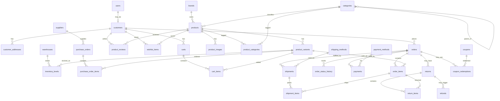

# Ecommerce Schema Plan (OLTP)

Normalized PostgreSQL schema for a real-world ecommerce domain.  
Purpose: feed the Nest API today and give **dbt** rich facts/dimensions for dashboards later.

> Scope: schema design only. App logic can stay thin — this is for analytics practice.

---

## Goals

- 3NF-style normalization (no repeating groups, clear FKs)
- Realistic ecommerce coverage: catalog, inventory, cart, checkout, payments, fulfillment, returns, promotions
- Enough grain for charts: revenue, orders, AOV, cohorts, geo, product/category, payments, refunds, inventory health

---

## High-level domains

```text
Identity & customers
Catalog (brands, categories, products, variants)
Inventory (warehouses, stock levels)
Commerce (carts → orders → payments → shipments)
Promotions (coupons, redemptions)
Post-purchase (reviews, returns/refunds)
```

Suggested Postgres schemas (optional later):

| Schema | Role |
|---|---|
| `public` / `oltp` | NestJS transactional tables |
| `analytics` (future) | dbt staging / marts (DuckDB or warehouse) |

---

## Entity relationship overview



---

## Tables (normalized)

### 1) Identity & customers

#### `users` (already exists — auth)
| Column | Type | Notes |
|---|---|---|
| id | uuid PK | |
| email | varchar UNIQUE | login identity |
| password_hash | varchar | |
| name | varchar NULL | |
| created_at / updated_at | timestamptz | |

#### `customers`
Shoppers profile (1:1 with `users` for logged-in buyers; guests can exist later via nullable `user_id`).

| Column | Type | Notes |
|---|---|---|
| id | uuid PK | |
| user_id | uuid NULL UNIQUE FK → users | |
| first_name / last_name | varchar | |
| phone | varchar NULL | |
| date_of_birth | date NULL | demographics |
| marketing_opt_in | boolean | |
| lifetime_value_cache | numeric(12,2) NULL | optional denorm later |
| created_at / updated_at | timestamptz | |

#### `customer_addresses`
| Column | Type | Notes |
|---|---|---|
| id | uuid PK | |
| customer_id | uuid FK → customers | |
| label | varchar | home / work |
| line1 / line2 | varchar | |
| city / state / postal_code | varchar | |
| country_code | char(2) | ISO |
| is_default_shipping | boolean | |
| is_default_billing | boolean | |
| created_at / updated_at | timestamptz | |

---

### 2) Catalog

#### `brands`
| Column | Type |
|---|---|
| id | uuid PK |
| name | varchar UNIQUE |
| slug | varchar UNIQUE |
| description | text NULL |
| is_active | boolean |
| created_at / updated_at | timestamptz |

#### `categories` (adjacency list tree)
| Column | Type | Notes |
|---|---|---|
| id | uuid PK | |
| parent_id | uuid NULL FK → categories | |
| name | varchar | |
| slug | varchar UNIQUE | |
| path | varchar NULL | materialize later if needed |
| created_at / updated_at | timestamptz | |

#### `products`
| Column | Type | Notes |
|---|---|---|
| id | uuid PK | |
| brand_id | uuid NULL FK → brands | |
| name | varchar | |
| slug | varchar UNIQUE | |
| description | text NULL | |
| status | varchar | draft / active / archived |
| created_at / updated_at | timestamptz | |

#### `product_categories` (M:N)
| Column | Type |
|---|---|
| product_id | uuid FK → products |
| category_id | uuid FK → categories |
| PK | (product_id, category_id) |

#### `product_variants` (sellable SKUs)
| Column | Type | Notes |
|---|---|---|
| id | uuid PK | |
| product_id | uuid FK → products | |
| sku | varchar UNIQUE | |
| name | varchar | e.g. Red / Large |
| attributes | jsonb | `{color,size}` |
| price_cents | int | store money as integer |
| compare_at_price_cents | int NULL | |
| cost_cents | int NULL | COGS for margin charts |
| weight_grams | int NULL | |
| is_active | boolean | |
| created_at / updated_at | timestamptz | |

#### `product_images`
| Column | Type |
|---|---|
| id | uuid PK |
| product_id | uuid FK → products |
| variant_id | uuid NULL FK → product_variants |
| url | varchar |
| position | int |
| alt_text | varchar NULL |

#### `product_reviews`
| Column | Type |
|---|---|
| id | uuid PK |
| product_id | uuid FK → products |
| customer_id | uuid FK → customers |
| order_id | uuid NULL FK → orders |
| rating | smallint CHECK 1–5 |
| title / body | text NULL |
| is_verified_purchase | boolean |
| created_at | timestamptz |

#### `wishlist_items`
| Column | Type |
|---|---|
| customer_id | uuid FK → customers |
| product_id | uuid FK → products |
| created_at | timestamptz |
| PK | (customer_id, product_id) |

---

### 3) Inventory & supply

#### `warehouses`
| Column | Type |
|---|---|
| id | uuid PK |
| code | varchar UNIQUE |
| name | varchar |
| city / country_code | varchar |
| is_active | boolean |

#### `inventory_levels`
| Column | Type | Notes |
|---|---|---|
| warehouse_id | uuid FK → warehouses | |
| variant_id | uuid FK → product_variants | |
| quantity_on_hand | int | |
| quantity_reserved | int | carts/orders hold |
| reorder_point | int | stockout alerts |
| PK | (warehouse_id, variant_id) | |
| updated_at | timestamptz | |

#### `suppliers`
| Column | Type |
|---|---|
| id | uuid PK |
| name | varchar |
| email / phone | varchar NULL |
| country_code | char(2) NULL |

#### `purchase_orders`
| Column | Type |
|---|---|
| id | uuid PK |
| supplier_id | uuid FK → suppliers |
| warehouse_id | uuid FK → warehouses |
| status | varchar | draft / ordered / received / cancelled |
| ordered_at / received_at | timestamptz NULL |
| created_at | timestamptz |

#### `purchase_order_items`
| Column | Type |
|---|---|
| id | uuid PK |
| purchase_order_id | uuid FK → purchase_orders |
| variant_id | uuid FK → product_variants |
| quantity_ordered | int |
| quantity_received | int |
| unit_cost_cents | int |

---

### 4) Cart → order → payment → shipment

#### `carts`
| Column | Type |
|---|---|
| id | uuid PK |
| customer_id | uuid NULL FK → customers |
| status | varchar | active / converted / abandoned |
| currency_code | char(3) |
| created_at / updated_at | timestamptz |

#### `cart_items`
| Column | Type |
|---|---|
| id | uuid PK |
| cart_id | uuid FK → carts |
| variant_id | uuid FK → product_variants |
| quantity | int |
| unit_price_cents | int |
| UNIQUE | (cart_id, variant_id) |

#### `orders`
| Column | Type | Notes |
|---|---|---|
| id | uuid PK | |
| order_number | varchar UNIQUE | human-facing |
| customer_id | uuid FK → customers | |
| cart_id | uuid NULL UNIQUE FK → carts | |
| status | varchar | pending / paid / fulfilled / cancelled / refunded |
| currency_code | char(3) | |
| subtotal_cents | int | |
| discount_cents | int | |
| shipping_cents | int | |
| tax_cents | int | |
| total_cents | int | |
| shipping_address_id | uuid NULL FK → customer_addresses | |
| billing_address_id | uuid NULL FK → customer_addresses | |
| placed_at | timestamptz | |
| created_at / updated_at | timestamptz | |

#### `order_items`
| Column | Type | Notes |
|---|---|---|
| id | uuid PK | |
| order_id | uuid FK → orders | |
| variant_id | uuid FK → product_variants | |
| product_name_snapshot | varchar | historical name |
| sku_snapshot | varchar | |
| quantity | int | |
| unit_price_cents | int | |
| discount_cents | int | |
| tax_cents | int | |
| line_total_cents | int | |

#### `order_status_history`
| Column | Type |
|---|---|
| id | uuid PK |
| order_id | uuid FK → orders |
| from_status | varchar NULL |
| to_status | varchar |
| changed_at | timestamptz |
| changed_by | varchar NULL | system / admin / webhook |

#### `payment_methods`
| Column | Type |
|---|---|
| id | uuid PK |
| code | varchar UNIQUE | card / paypal / cod / gcash |
| name | varchar |

#### `payments`
| Column | Type |
|---|---|
| id | uuid PK |
| order_id | uuid FK → orders |
| payment_method_id | uuid FK → payment_methods |
| amount_cents | int |
| status | varchar | pending / succeeded / failed / refunded |
| provider_ref | varchar NULL |
| paid_at | timestamptz NULL |
| created_at | timestamptz |

#### `shipping_methods`
| Column | Type |
|---|---|
| id | uuid PK |
| code | varchar UNIQUE |
| name | varchar |
| base_rate_cents | int |

#### `shipments`
| Column | Type |
|---|---|
| id | uuid PK |
| order_id | uuid FK → orders |
| shipping_method_id | uuid FK → shipping_methods |
| warehouse_id | uuid NULL FK → warehouses |
| tracking_number | varchar NULL |
| status | varchar | pending / shipped / delivered / lost |
| shipped_at / delivered_at | timestamptz NULL |
| created_at | timestamptz |

#### `shipment_items`
| Column | Type |
|---|---|
| id | uuid PK |
| shipment_id | uuid FK → shipments |
| order_item_id | uuid FK → order_items |
| quantity | int |

---

### 5) Promotions

#### `coupons`
| Column | Type | Notes |
|---|---|---|
| id | uuid PK | |
| code | varchar UNIQUE | |
| discount_type | varchar | percent / fixed |
| discount_value | int | percent or cents |
| min_order_cents | int NULL | |
| max_redemptions | int NULL | |
| starts_at / ends_at | timestamptz NULL | |
| is_active | boolean | |

#### `coupon_redemptions`
| Column | Type |
|---|---|
| id | uuid PK |
| coupon_id | uuid FK → coupons |
| order_id | uuid UNIQUE FK → orders |
| customer_id | uuid FK → customers |
| discount_cents | int |
| redeemed_at | timestamptz |

---

### 6) Returns & refunds

#### `returns`
| Column | Type |
|---|---|
| id | uuid PK |
| order_id | uuid FK → orders |
| status | varchar | requested / approved / received / rejected |
| reason | varchar NULL |
| requested_at | timestamptz |
| resolved_at | timestamptz NULL |

#### `return_items`
| Column | Type |
|---|---|
| id | uuid PK |
| return_id | uuid FK → returns |
| order_item_id | uuid FK → order_items |
| quantity | int |
| condition | varchar | unopened / used / damaged |

#### `refunds`
| Column | Type |
|---|---|
| id | uuid PK |
| return_id | uuid NULL FK → returns |
| payment_id | uuid FK → payments |
| amount_cents | int |
| status | varchar | pending / completed / failed |
| refunded_at | timestamptz NULL |
| created_at | timestamptz |

---

## Money & status conventions

- Store currency amounts as **integer cents** (`*_cents`) + `currency_code`
- Prefer explicit status enums as `varchar` + CHECK (or Postgres enums later)
- Snapshot product name/SKU on `order_items` (history-safe analytics)
- Keep operational quantity math in `inventory_levels`; don’t duplicate stock on products

---

## Suggested seed volume (for charts)

| Table | Approx rows |
|---|---|
| customers | 200–500 |
| products | 80–120 |
| product_variants | 250–400 |
| orders | 2,000–5,000 |
| order_items | 5,000–15,000 |
| payments / shipments | ~orders |
| returns / refunds | 5–10% of orders |
| inventory_levels | variants × warehouses |

Date span: **12–24 months** of `placed_at` so time-series charts look real.

---

## dbt analytics targets

Full medallion (Bronze / Silver / Gold) design + chart plan: **[`ANALYTICS.md`](./ANALYTICS.md)**

### Quick map
| Layer | Examples |
|---|---|
| Bronze | `bronze_oltp__orders`, `bronze_oltp__order_items`, … |
| Silver | `silver_fct_orders`, `silver_dim_customers`, `silver_dim_variants` |
| Gold | `gold_mart_daily_sales`, `gold_mart_product_sales`, `gold_mart_customer_cohorts` |

---

## Implementation order (when coding)

1. Keep `users` as auth  
2. `customers` + addresses  
3. Catalog (`brands` → `categories` → `products` → `variants`)  
4. Inventory  
5. Carts / orders / order_items / status history  
6. Payments + shipments  
7. Coupons  
8. Returns / refunds / reviews  
9. Seed generator for historical sales  
10. dbt bronze → silver → gold (see [`ANALYTICS.md`](./ANALYTICS.md))  
11. Nest analytics APIs + client charts (P0 dashboard first)

---

## Notes for this showcase

- Normalize OLTP; **dbt gold** denormalizes for BI/charts
- Don’t overbuild Nest CRUD — seed + read APIs for dashboards are enough
- Prefer `timestamptz` everywhere for correct time-series grouping
- Add indexes later on: `orders(placed_at)`, `orders(customer_id)`, `order_items(variant_id)`, `payments(status)`, `inventory_levels(quantity_on_hand)`
